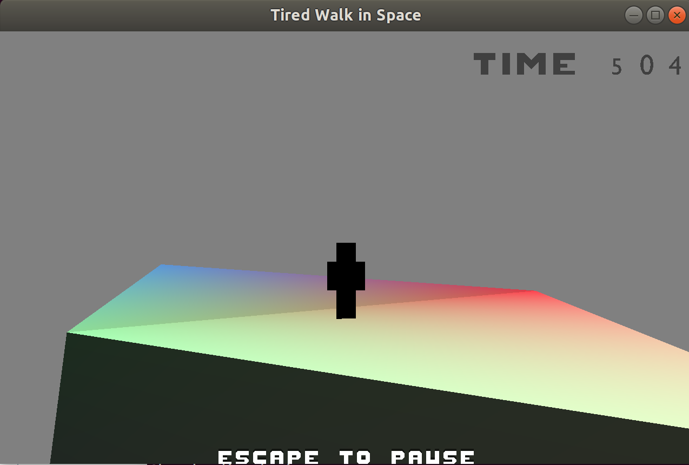

# Game Information

Title: Tired Walk In Space

Author: Yixin He

Design Document: [Tired Walk in Space Design Document](http://graphics.cs.cmu.edu/courses/15-466-f18/game1-designs/yixinh/)

Screen Shot:



How To Play:

Use left and right arrow keys to change direction of the player. Press forward and backwards and watch as the player(sometimes) walk properly on the land. 

Changes From The Design Document:

Basically none of the game was implemented besides the ability to walk, and the code to generate a (very simple) geometric landscape in blender. 

Good / Bad / Ugly Code:
The good: I think the my code to parse the walk mesh is very simplistic (and probably doesn't have many checks that the walk mesh is good and legitimate), but it is very readable and clear. 

The bad: The code to keep the camera trained on the player. Parenting wasn't implemented, so it's just multipling by the rotation and setting the position equal to an offset from that of the players. 

The ugly: pretty much the entirety of WalkMesh::walk(). My understanding of the math that goes into it is mediocre, and the code also only works some of the time. 


##Base Code

The base code used for this project can be found [here](https://github.com/ixchow/15-466-f18-base1).

## Runtime Build Instructions

The runtime code has been set up to be built with [FT Jam](https://www.freetype.org/jam/).

### Getting Jam

For more information on Jam, see the [Jam Documentation](https://www.perforce.com/documentation/jam-documentation) page at Perforce, which includes both reference documentation and a getting started guide.

On unixish OSs, Jam is available from your package manager:
```
	brew install ftjam #on OSX
	apt get ftjam #on Debian-ish Linux
```

On Windows, you can get a binary [from sourceforge](https://sourceforge.net/projects/freetype/files/ftjam/2.5.2/ftjam-2.5.2-win32.zip/download),
and put it somewhere in your `%PATH%`.
(Possibly: also set the `JAM_TOOLSET` variable to `VISUALC`.)

### Libraries

This code uses the [libSDL](https://www.libsdl.org/) library to create an OpenGL context, and the [glm](https://glm.g-truc.net) library for OpenGL-friendly matrix/vector types.
On MacOS and Linux, the code should work out-of-the-box if if you have these installed through your package manager.

If you are compiling on Windows or don't want to install these libraries globally there are pre-built library packages available in the
[kit-libs-linux](https://github.com/ixchow/kit-libs-linux),
[kit-libs-osx](https://github.com/ixchow/kit-libs-osx),
and [kit-libs-win](https://github.com/ixchow/kit-libs-win) repositories.
Simply clone into a subfolder and the build should work.

### Building

Open a terminal (or ```x64 Native Tools Command Prompt for VS 2017``` on Windows), change to the directory containing this code, and type:

```
jam
```

That's it. You can use ```jam -jN``` to run ```N``` parallel jobs if you'd like; ```jam -q``` to instruct jam to quit after the first error; ```jam -dx``` to show commands being executed; or ```jam main.o``` to build a specific file (in this case, main.cpp).  ```jam -h``` will print help on additional options.
